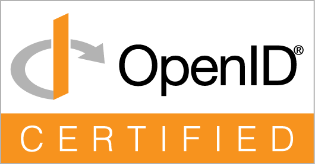

# OpenID Connect Certification

<a href="https://openid.net/certification/certified-openid-relying-parties-profiles/">
  
</a>

> **Certified.** py-identity-model is [OpenID Certified<sup>®</sup>](https://openid.net/certification/certified-openid-relying-parties-profiles/)
> by the OpenID Foundation as a Relying Party for the **Basic RP**, **Config RP**,
> and **Form Post Basic RP** profiles — certified **2 July 2026** as
> `py-identity-model 3.1.0`. The listing appears on the OIDF
> [Certified OpenID Relying Parties](https://openid.net/certification/certified-openid-relying-parties-profiles/)
> and [Certified OpenID Connect Implementations](https://openid.net/certification/certified-openid-connect-implementations/)
> pages. *OpenID Certified is a certification mark of the OpenID Foundation.*

This page documents how py-identity-model is tested for, and submitted to, the
[OpenID Foundation conformance program](https://openid.net/certification/) as a
certified **Relying Party (RP)** library, and how the submission artifacts are
generated from this repository.

## What is certified

The **library itself** is the certified deployment — listed as
`py-identity-model 3.1.0`, the same model Roland Hedberg used for
`pyoidc`/`oidcrp` and Duende used for `IdentityModel.OidcClient`. The
`conformance/` harness is **disposable scaffolding** that drives the library
through the OIDF conformance suite; it is not shipped, versioned, or certified.

Certified profiles (certified 2 July 2026, all passing against `certification.openid.net`):

| Profile | Plan | Result |
|---------|------|--------|
| Basic RP | `oidcc-client-basic-certification-test-plan` | 13 pass / 1 skip |
| Config RP | `oidcc-client-config-certification-test-plan` | 5 pass / 1 skip |
| Form Post Basic RP | `oidcc-client-formpost-basic-certification-test-plan` | 13 pass / 1 skip |

The single skip per profile is `oidcc-client-test-idtoken-sig-none` — expected,
because py-identity-model correctly rejects unsigned ID tokens (secure default).

## The harness

- `conformance/app.py` — a thin FastAPI RP that exercises the library's public
  API (discovery, auth-code + PKCE, token validation, UserInfo).
- `conformance/run_tests.py` — drives the suite's REST API and walks the RP
  through each test module. Works against the local Docker suite (regression)
  or the hosted suite (submission-grade).
- `conformance/docker-compose.yml` — the local OIDF suite for regression CI.

See `conformance/README.md` for the operational details (setup, SSL, token
rotation).

## Submission artifacts

An OIDF RP submission needs **two artifacts per profile**, both produced by a
hosted run:

### 1. Signed plan export (suite-side evidence)

Downloaded from `GET /api/plan/{kind}/{plan_id}` — the `export` variant is a
JSON + RSA-signature zip (the format the suite recommends for automation).
Produced by `run_tests.py --export-zip <path>` (gated to a hosted suite when
every test passes). This is **not** the certification package — see
[Submitting to OIDF](#submitting-to-oidf).

### 2. RP client-side logs (`clientSideData`)

OIDF requires **one log file per test**, demonstrating
the RP's behaviour — in particular that negative tests are *rejected*
([submission rules](https://openid.net/certification/connect_rp_submission/)).
The conformance suite only logs the OP side, so the RP harness produces these
itself.

#### How the logs are generated

The harness and runner are separate processes, so capture is split:

1. **Runner tags each test.** For every test module, `run_test_module` →
   `drive_rp_authorize` / `drive_rp_discover` pass the suite's `test_name` and
   the `profile` to the harness as query params. The `/clear-cache` call before
   each test also clears the active-test pointer.
2. **Harness routes records per active test.** `_set_active_test(profile,
   test_name)` sets a process-global pointer at `/authorize` and `/discover`,
   and re-establishes it in `/callback` (recovered from the session, since the
   OP redirect carries only `state`). A `logging.Handler` attached to the
   `conformance-rp` (harness) and `py_identity_model` (library, DEBUG) loggers
   appends every record to `<RP_LOG_DIR>/<profile>/<test_name>.log`. Explicit
   `ACCEPTED` / `REJECTED: <reason>` lines are logged at each decision point.
3. **Runner bundles per profile.** `--rp-logs-zip <path>` resets the
   per-profile directory before the run and zips it after — one file per test.

The runner drives tests strictly sequentially, so a single process-global
pointer is sufficient. `RP_LOG_DIR` defaults to an absolute path derived from
the source location so the harness and the separately-launched runner agree on
it regardless of working directory (override it for *both* processes if you
change it).

A negative test log shows both the library's own rejection and the harness
decision, e.g.:

```
py_identity_model: Invalid issuer
conformance-rp: REJECTED: id_token validation failed: Invalid issuer
```

A positive test log shows the full acceptance trail:

```
conformance-rp: ACCEPTED: id_token validated by py-identity-model (signature, issuer, audience, expiry)
conformance-rp: ACCEPTED: authentication successful ... sub=user-subject-1234531
```

#### Compliance with OIDF requirements

| OIDF requirement | How it is met |
|------------------|---------------|
| One log file per test (not one combined log) | One `<test_name>.log` per module |
| Identifiable per test | Files named by the suite test module name (e.g. `oidcc-client-test-...`), one per plan module |
| Must demonstrate detecting the error condition | Negative tests log the library rejection plus a `REJECTED:` line |
| One zip per profile | One `<plan>-rp-logs.zip` per profile |

Notes:

- OIDF reviews these **by hand** (no machine schema), so a reviewer may request
  more detail; the logs include both the library's records and explicit
  decisions to make the behaviour unambiguous.
- OIDF also mentions **screenshots** for interactive/browser login steps — not
  applicable here, as these three plans run fully automated server-to-server.

## Producing the artifacts

A long-lived API token for the hosted suite is required (`CONFORMANCE_TOKEN`);
see `conformance/README.md` for token rotation.

```bash
# Local regression (Docker suite) — no submission artifacts
make conformance-test

# Hosted run — produces <plan>-export.zip + <plan>-rp-logs.zip per profile
make conformance-test HOSTED=1 CONFORMANCE_SERVER=https://www.certification.openid.net/
#   -> conformance/results/hosted/<plan>-export.zip
#   -> conformance/results/hosted/<plan>-rp-logs.zip   (one <test_name>.log per test)
```

The zips are git-ignored binaries. In CI, the `conformance-hosted` workflow
(`workflow_dispatch`) produces the same artifacts and uploads them:

```bash
gh workflow run conformance-hosted.yml --ref <branch>
gh run download <run-id> -n conformance-hosted-results
```

`--publish {none,summary,everything}` (default `none`) controls whether a run is
listed on the public published-tests list; the artifacts are produced
regardless.

## Submitting to OIDF

The **Certification of Conformance is not a downloadable template.** The current
flow is portal-based:

0. **Obtain a payment code first — this is a hard prerequisite.** The submission
   form at <https://submissions.openid.net/> cannot be started without one. The
   form states: *"The Payment Code was created when the payment for the
   submission was done or the invoice requested."* The standard fee is **$700**
   per deployment (member rate; see
   <https://openid.net/certification/fees/>). py-identity-model **may qualify**
   for a no-cost waiver under the OIDF **Open-Source Project Certification
   Policy** (<https://openid.net/certification/open-source-project-certification-policy/>),
   which the OIDF evaluates **case-by-case** — "Not all open source projects
   will qualify." Request the waiver from `certification@oidf.org`
   (Apache-2.0, unpaid individual maintainer); if granted, the waiver reference
   code goes in the form's payment-code field. See issue #331. (OIDF members can
   recover an existing code under
   <https://openid.net/foundation/members/certifications/>.)
1. Go to **<https://submissions.openid.net/>** and complete the web form
   (deployment name `py-identity-model <version>`, profiles, payment code, etc.).
2. **Upload the artifacts** — up to **6 zip files** total. We submit exactly 6:
   the test result zip (`*-export.zip`) and the client data zip (`*-rp-logs.zip`)
   for each of the three profiles.
3. OIDF validates the submission and **sends the Declaration of Conformance for
   signature** to the designated signer, then generates the certification.
   Processing usually takes a few working days. (The form does not specify the
   signature mechanism — do not assume DocuSign or any particular tool.)

!!! note "Alternative API path"
    The suite's `scripts/conformance.py` exposes a programmatic
    `POST /api/plan/{id}/certificationpackage` (multipart: a *pre-signed*
    Certification of Conformance PDF + the `clientSideData` zip) which
    **publishes and permanently freezes** the plan. The portal flow above is the
    standard route and does not require you to produce the PDF yourself.

## Status

**Certified.** The submission for `py-identity-model 3.1.0` was approved and
published by the OIDF on **2 July 2026**, covering the **Basic RP**, **Config
RP**, and **Form Post Basic RP** profiles. The listing is live on the OIDF
[Certified OpenID Relying Parties](https://openid.net/certification/certified-openid-relying-parties-profiles/)
and [Certified OpenID Connect Implementations](https://openid.net/certification/certified-openid-connect-implementations/)
pages. Tracked in #331 / #242.

The submission workflow that produced this certification (all steps complete):

1. ~~**Obtain a payment code**~~ — done (fee waiver via `certification@oidf.org`).
2. ~~Complete the portal submission and upload the 6 artifact zips.~~ — done.
3. ~~Sign the Declaration of Conformance when OIDF sends it for signature.~~ — done.

### Re-certifying a new version

Certification is pinned to the certified version (`3.1.0`). A later release is
**not** automatically certified. To certify a new version, re-run the hosted
suite to regenerate the 6 artifacts (`make conformance-test HOSTED=1 ...`) and
repeat the [portal submission](#submitting-to-oidf) for the new deployment name.
